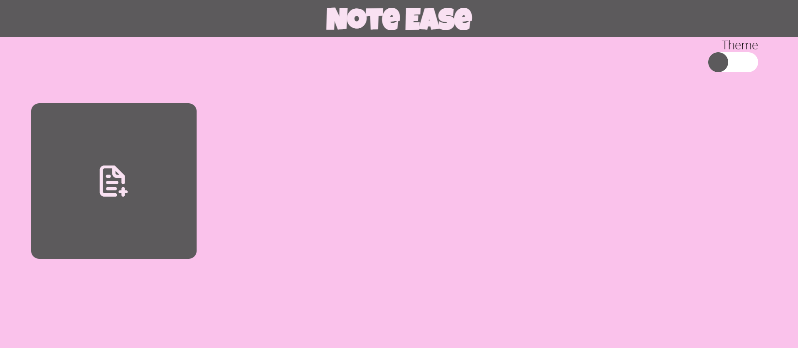
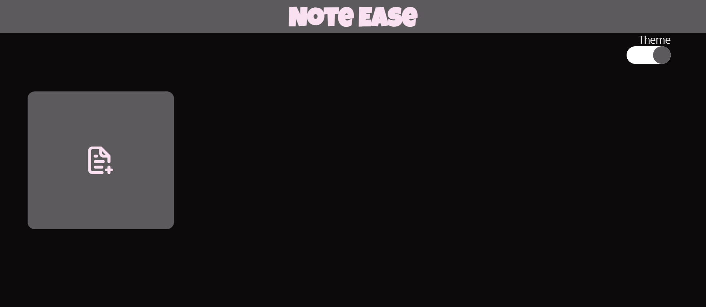
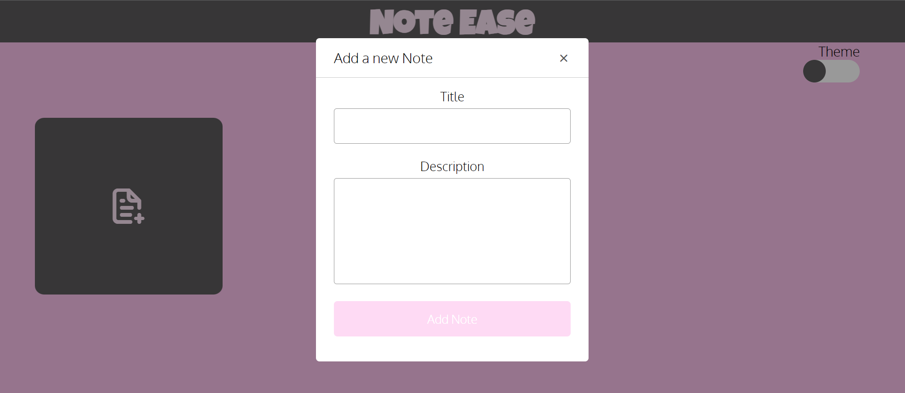

# Note Ease
## Introduction

Introducing our innovative notes app, designed to streamline your organization and productivity. With a user-friendly interface, it allows you to create, edit, and delete notes effortlessly. Say goodbye to cluttered notebooks and embrace a smarter way to manage your thoughts and ideas. This app is created using HTML, CSS, and JavaScript and is perfect jottting down notes and ideas quickly and easily.

## Preview

## Features

- Interactive and user-friendly interface
- Easy notes creation and deletion
- Responsive design for optimal user experience on different devices
- Option to save and resume quizzes at a later time

## Deployment

This app can be deployed in two ways:

1. Clone the repository and run the index.html file locally on your computer
2. Deploy the app on a web server and access it through a web browser

## Requirements

- A modern web browser such as Google Chrome, Mozilla Firefox, or Microsoft Edge
- Basic knowledge of HTML, CSS, and JavaScript

## How to Use

1. Clone the repository or download the files to your computer
2. Open the index.html file in a web browser
3. Create, edit, and delete notes using the app
4. Option to save and access notes at a later time

## Conclusion

This meticulously crafted notes app, harmoniously blending HTML, CSS, and JavaScript, redefines your note-taking experience. Its user-friendly interface, and seamless editing capabilities empower you to capture, refine, and manage your thoughts effortlessly. Embrace a smarter way to stay organized and productive with this innovative tool.
 
